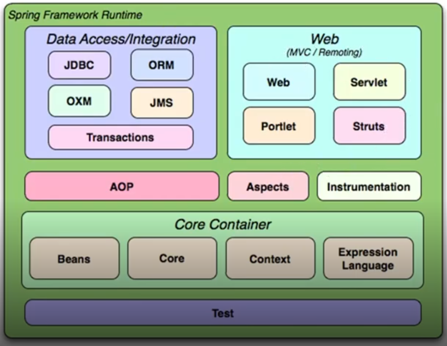

# Springboot Framework

## Entender o Core do Spring

### Core e Beans

- Estrutura
- IoC
- Injeção de Dependências
- BeanFactory

## Inversão de controle

É um princípio de design de programas de computadores onde a sequência (o controle) de chamadas dos métodos é invertida em relação à programação tradicional, ou seja, não é determinada diretamente pelo programador.

