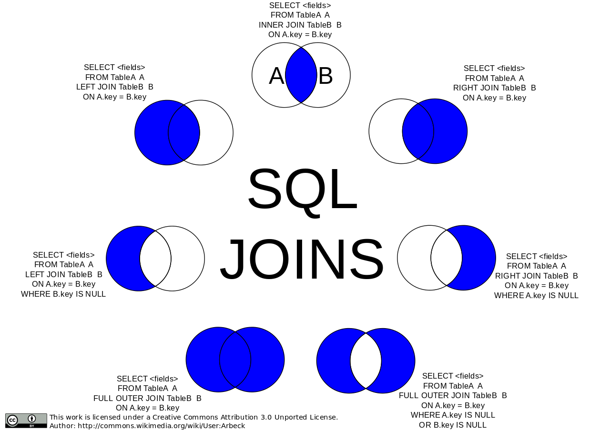

# COmandos do curso

Para comentar no SQL, é --.

## Select

Tudo:

```
SELECT * FROM CLIENTES;
```

### Ordenando

```
SELECT * FROM CLIENTES
ORDER BY Nome
```

Ordenar ao contrário, decrescente:

```
SELECT * FROM CLIENTES
ORDER BY Nome DESC
```

Crescente (padrão):

```
SELECT * FROM CLIENTES
ORDER BY Nome ASC
```

Ordenar por mais de uma coluna:

```
SELECT * FROM CLIENTES
ORDER BY Nome, Sobrenome
```

Escolhendo as colunas para mostrar:

```
SELECT Nome, Sobrenome, Email FROM CLIENTES
ORDER BY Nome, Sobrenome
```

## Where

Quando queremos filtrar determinados tipos de dados.

```
SELECT Nome, Sobrenome, Email FROM CLIENTES
WHERE Nome = 'Adam'
ORDER BY Nome, Sobrenome
```

```
SELECT Nome, Sobrenome, Email FROM CLIENTES
WHERE Nome = 'Adam' AND Sobrenome = 'Reynolds'
ORDER BY Nome, Sobrenome
```

Pode-se usar o OR (ou) também, o mesmo princípio da programação:

```
SELECT Nome, Sobrenome, Email FROM CLIENTES
WHERE Nome = 'Adam' OR Sobrenome = 'Reynolds'
ORDER BY Nome, Sobrenome
```

## LIKE

Quando quero que todos os meus clientes, por exemplo, comecem com "g".

Assim não funciona.

```
SELECT Nome, Sobrenome, Email FROM CLIENTES
WHERE Nome = 'G'
ORDER BY Nome
```

Usamos pra isso o LIKE.

```
SELECT Nome, Sobrenome, Email FROM CLIENTES
WHERE Nome LIKE 'G%'
ORDER BY Nome, Sobrenome
```

Quando eu quero todos os que tenham a letra "g" no nome:

```
SELECT Nome, Sobrenome, Email FROM CLIENTES
WHERE Nome LIKE '%G%'
ORDER BY Nome, Sobrenome
```

## INSERT

Inserir registros no banco de dados.

```
INSERT INTO Clientes (Nome, Sobrenome, Email, AceitaComunicados, DataCadastro)
VALUES ('Leonardo', 'Ruoso Vendramini', 'leonardo@email.com', 1, GETDATE())
```

```
INSERT INTO Clientes VALUES ('Leonardo', 'Ruoso Vendramini', 'leonardo@email.com', 1, GETDATE())
```

O id vai se incrementando, 1, 2, 3, 4... e se eu deletar o 4, e inserir algo, ele vai ter o id 5. Ele continua a contar. Ele é único.

## Update

Recomendado sempre usar com o Id, para atualizar apenas um registro e não todo mundo que atender outra determinado condição.

```
UPDATE Clientes
SET Email = 'emailatualizado@email.com',
    AceitaComunicados = 0
WHERE Id = 3
```

Um caso destrutivo é o update sem o WHERE. **Nunca faça isso**, a não ser que você tenha plena ciência do que está fazendo.

Uma dica é, trabalhar com o BEGIN TRAN, significando que estamos trabalhando em um modo que poderemos desfazer essas alterações.

Se o ROLLBACK for executado, ele voltará ao cenário anterior, quando foi dado o BEGIN TRAN.

```
BEGIN TRAN
ROLLBACK
```

## DELETE

```
DELETE Clientes
WHERE Id = 1
```

## Criação de uma Tabela

```
CREATE TABLE Clientes (
    Id int IDENTITY(1,1) PRIMARY KEY NOT NULL,
    Nome varchar(255) NULL,
    Sobrenome varchar(255) NULL,
    Email varchar(255) NULL,
    AceitaComunicados bit NULL,
    DataCadastro datetime2(7) NULL
)
```

```
CREATE TABLE Produtos (
    Id int IDENTITY(1,1) PRIMARY KEY NOT NULL,
    Nome varchar(255) NOT NULL,
    Cor varchar(255) NULL,
    Preco decimal(13,2) NOT NULL,
    Tamanho varchar(5) NULL,
    Genero char(1) NULL
)
```

### Tipos de dados

https://www.w3schools.com/sql/sql_datatypes.asp


## Manipulando dados

### COUNT

Conta a quantidade de linhas de uma tabela, com uma determinada condição.

Contar todos os itens de uma tabela. Retorna apenas a contagem, não dados.

```
SELECT COUNT(*) FROM Produtos
```

Dando um nome para a coluna:

```
SELECT COUNT(*) QuantidadeProdutos FROM Produtos
```

Podemos também usar o WHERE.

```
SELECT COUNT(*) QuantidadeProdutosTamanhoM FROM Produtos WHERE Tamanho = 'M';
```

### SUM

Retorna a quantidade de uma coluna somada entre si.

```
SELECT SUM(Preco) PrecoTotal FROM Produtos
```

Com WHERE:

```
SELECT SUM(Preco) PrecoTotalProdutosTamanhoM FROM Produtos WHERE Tamanho = 'M'
```

### MAX, MIN e AVG

Qual o produto mais caro:

```
SELECT MAX(Preco) ProdutoMaisCaroTamanhoM FROM Produtos WHERE Tamanho = 'M'
```

Qual o produto mais barato:

```
SELECT MIN(Preco) ProdutoMaisBaratoTamanhoM FROM Produtos WHERE Tamanho = 'M'
```

Qual a média de preços dos produtos:

```
SELECT AVG(Preco) FROM Produtos
```

### Concatenando colunas

Vamos supor que eu queira mostrar o nome do produto com um traço e a cor dele:

```
SELECT
    Nome + ' - ' + Cor
FROM Produtos
```

Com um texto, mesma coisa:

```
SELECT
    Nome + ', Cor: ' + Cor
FROM Produtos
```

### UPPER e LOWER

Vamos supor que eu queira o nome maiúsculo:

```
SELECT
    UPPER(Nome) + ', Cor: ' + Cor
FROM Produtos
```

Cor em minúsculo:

```
SELECT
    Nome + ', Cor: ' + LOWER(Cor)
FROM Produtos
```

### Adicionando uma nova coluna na tabela

Por exemplo, adicionando uma coluna de data.

```
ALTER TABLE Produtos
ADD DataCadastro DATETIME2
```

Daí se eu quero atualizar todo mundo, sem excessão (cuidado):

```
UPDATE Produtos SET DataCadastro = GETDATE()
```

### Formatando uma data

Usando FORMAT, e dando o nome da coluna sendo Data:

```
SELECT
    Nome,
    FORMAT(DataCadastro, 'dd/MM/yyyy HH:mm') Data
FROM Produtos
```

### GROUP BY

Podemos criar agrupamentos, por exemplo, quero saber quantos produtos que eu tenho, agrupando pelo tamanho dos produtos.

```
SELECT
    Tamanho,
    COUNT(*) Quantidade
FROM Produtos
GROUP BY Tamanho
```

O Count() não necessariamente tem que estar por último, poderia estar em primeiro também.

Pode ter algum campo que esteja em branco, um produto que por exemplo não tem informação de tamanho, então, pra não mostrar ele:

```
SELECT
    Tamanho,
    COUNT(*) Quantidade
FROM Produtos
WHERE Tamanho <> ''
GROUP BY Tamanho
```

E se eu quero ordenar do maior pro menor? Assim:

```
SELECT
    Tamanho,
    COUNT(*) Quantidade
FROM Produtos
WHERE Tamanho <> ''
GROUP BY Tamanho
ORDER BY Quantidade DESC
```

O sinal de <> é meio estranho, mas significa *diferente*, pode usar também o !=.

Esta foi uma query bem completa do SQL, e tem que respeitar essa ordem. Por exemplo, não posso mover o ORDER BY pra antes do GROUP BY, vai dar um erro. Essa ordem é importante. Nem tudo precisa colocar, mas se você for colocar, precisa ser nessa ordem.

## PK e FK

**Primary Key**: Chave única que identifica cada registro na tabela.

**Foreign Key**: Chave que identifica um registro existente em outra tabela.

```
CREATE TABLE Clientes (
    Id int IDENTITY(1,1) PRIMARY KEY NOT NULL,
    Nome varchar(255) NULL,
    Sobrenome varchar(255) NULL,
    Email varchar(255) NULL,
    AceitaComunicados bit NULL,
    DataCadastro datetime2(7) NULL
)
```

```
CREATE TABLE Enderecos (
    Id int PRIMARY KEY IDENTITY(1,1) NOT NULL,
    IdCliente int NULL,
    Rua varchar(255) NULL,
    Bairro varchar(255) NULL,
    Cidade varchar(255) NULL,
    Estado char(2) NULL,

    CONSTRAINT FK_Enderecos_Clientes FOREIGN KEY(IdCliente)
    REFERENCES Clientes(Id)
)
```

Toda Foreign key é uma constraint, uma restrição.

## INNER JOIN

Vamos juntar duas tabelas, num único select.

```
SELECT
    *
FROM
    Clientes
INNER JOIN Enderecos ON Clientes.Id = Enderecos.IdCliente
WHERE Clientes.Id = 4
```

Inner join é uma junção, vai juntar as duas tabelas, inclusive, vai mostrar dois Ids.

Melhor seria:

```
SELECT
    Clientes.Nome,
    Clientes.Sobrenome,
    Clientes.Email,
    Enderecos.Rua,
    Enderecos.Cidade
FROM
    Clientes
INNER JOIN Enderecos ON Clientes.Id = Enderecos.IdCliente
WHERE Clientes.Id = 4
```

Melhor ainda:

```
SELECT
    C.Nome,
    C.Sobrenome,
    C.Email,
    E.Rua,
    E.Cidade
FROM
    Clientes C
INNER JOIN Enderecos E ON C.Id = E.IdCliente
WHERE C.Id = 4
```

